## Step 1: ​Installing Arduino IDE Software
Install Arduino IDE software from the link http://www.arduino.cc/en/main/software

## Step 2: Start Arduino IDE 
After installing start Arduino IDE.
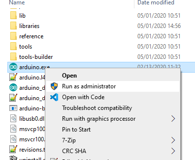 

## Step 3: Preferences
Open the File and click on the Preferences as shown in the figure.
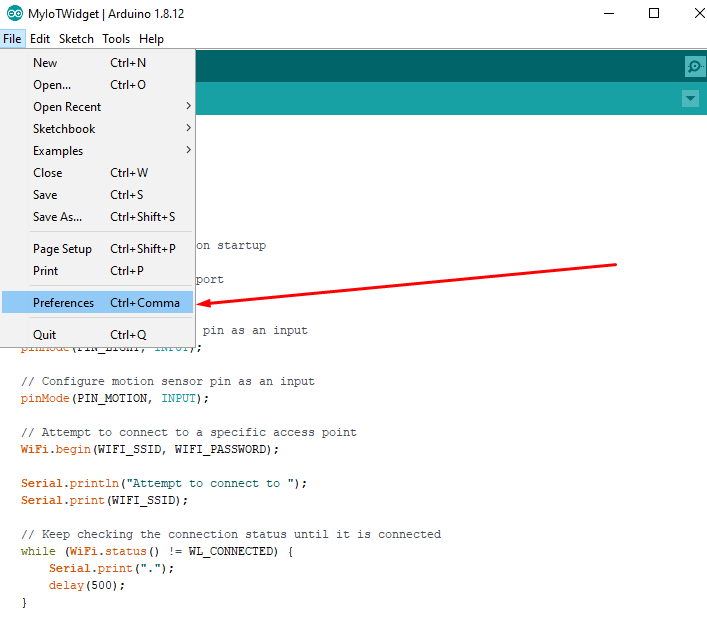 

## Step 4: Adding ESP8266 Board Manager
In the Additional Boards Manager enter below URL and enter OK.
http://arduino.esp8266.com/stable/package_esp8266com_index.json
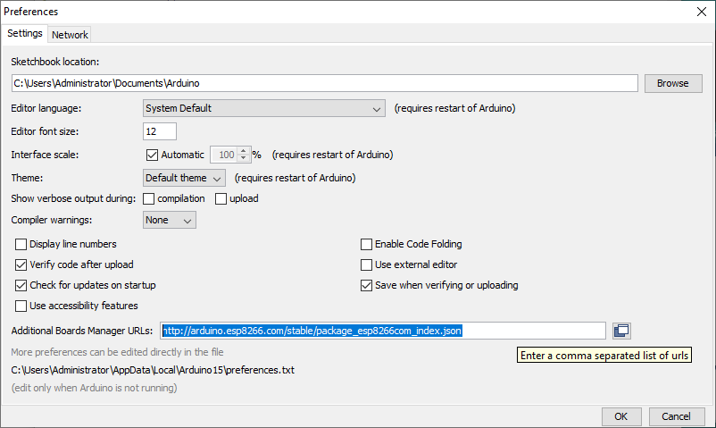 
Now open the tools in that select Board and click on the Boards Manager as shown in the figure.

## Step 5: Board Manager
Now open the tools in that select Board and click on the Boards Manager as shown in the figure.
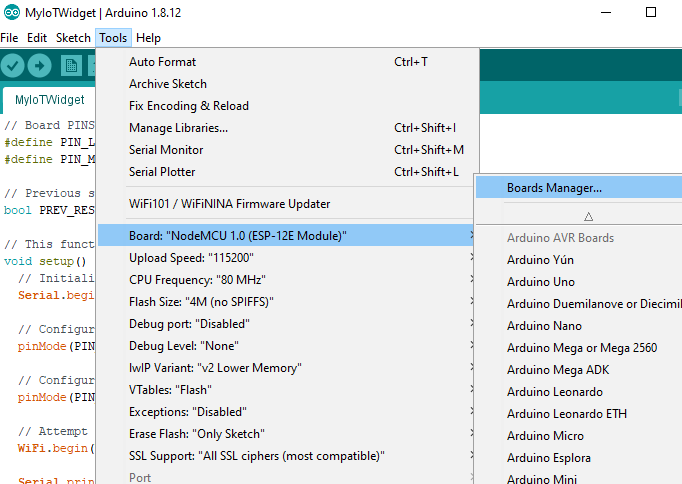 

## Step 6: ESP8266 Board Package
The Boards Manager window opens, scroll the window page to bottom till you see the module with the name ESP8266. Once we get it, select that module and select version and click on the Install button. When it is installed it shows Installed in the module as shown in the figure and then close the window.
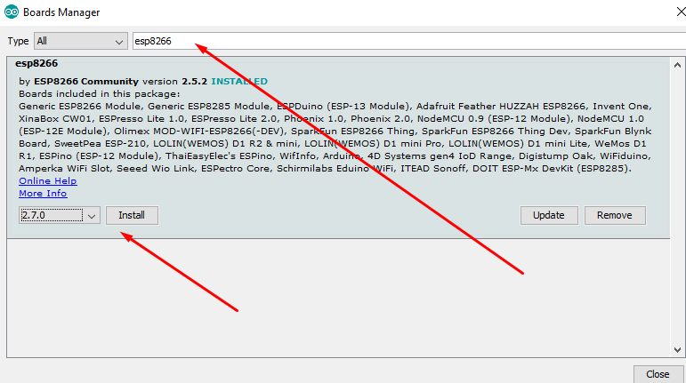 

## Step 7: Selecting NodeMCU Arduino Board
To run the ESP8266 with Arduino we have to select the Board: and then select NodeMCU 1.0 (ESP-12E Module) or other esp8266 modules depending on what you have .This can be done by scrolling down, as shown in the figure
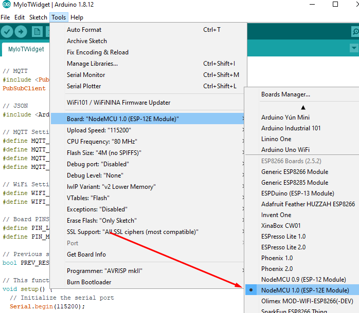 

## Step 8: Libraries Manager
Now open the tools in that click on the Manage Libraries... as shown in the figure.
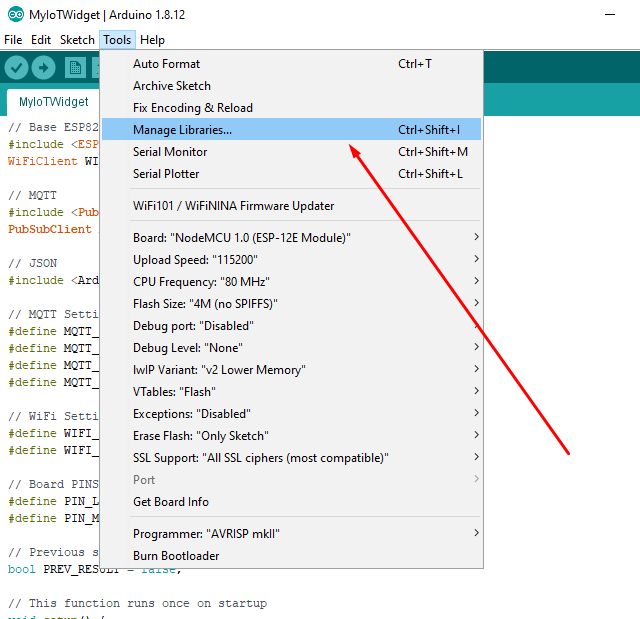

## Step 9: Installing PubSubClient & ArduinoJSON library
The Libraries Manager window opens, find PubSubClient library. Once we get it, select that library and select version and click on the Install button. Then repeat this procedure with the ArduinoJSON library. After installation you can close the window.
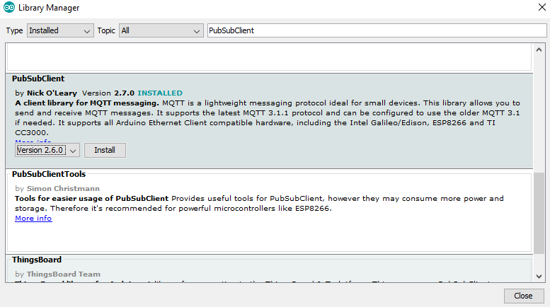 
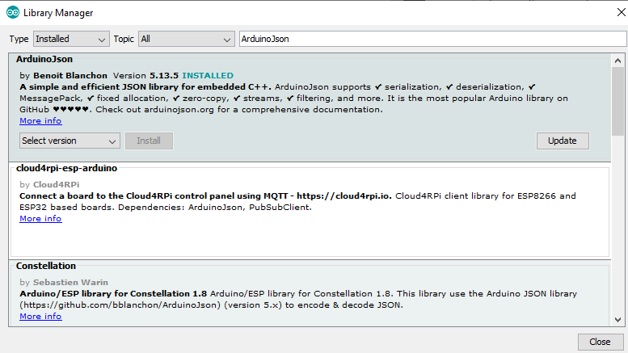

## Step 10: Connecting NodeMCU to the PC
Now Let’s connect the NodeMCU to your computer through USB cable as shown in the figure. When module is connected to the USB, COM port is detected eg: here COM5 is shown in the figure.
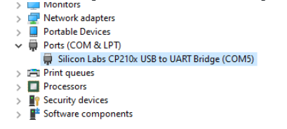

## Step 12: Selecting COM Port
Click on tools to select the port: “COM” based on which ESP8266 module is connected to your respected COM port of the computer. To select COM port refer previous steps.
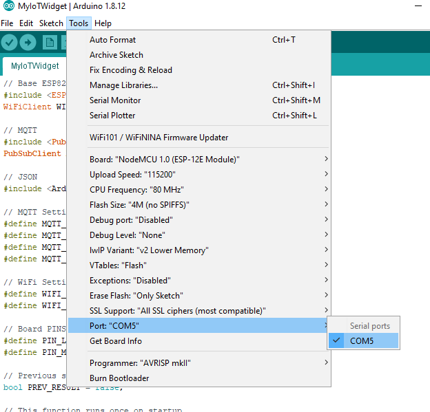

## Step 14: Uploading the Program to NodeMCU
On the program, code change defines to preferred ones and then click on the right arrow shown in the figure to upload the program to the module.
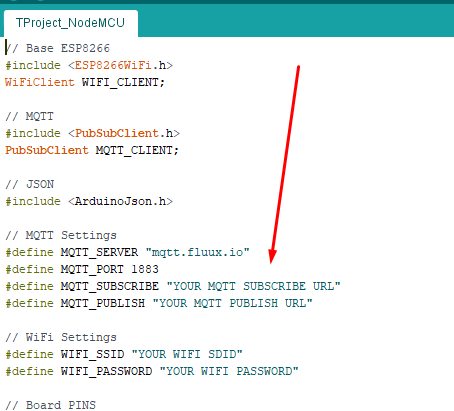
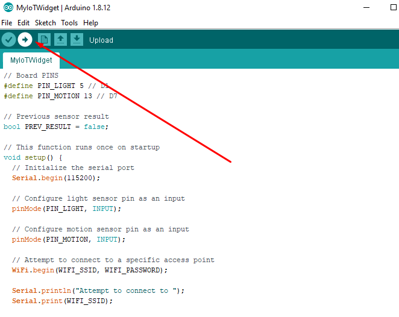